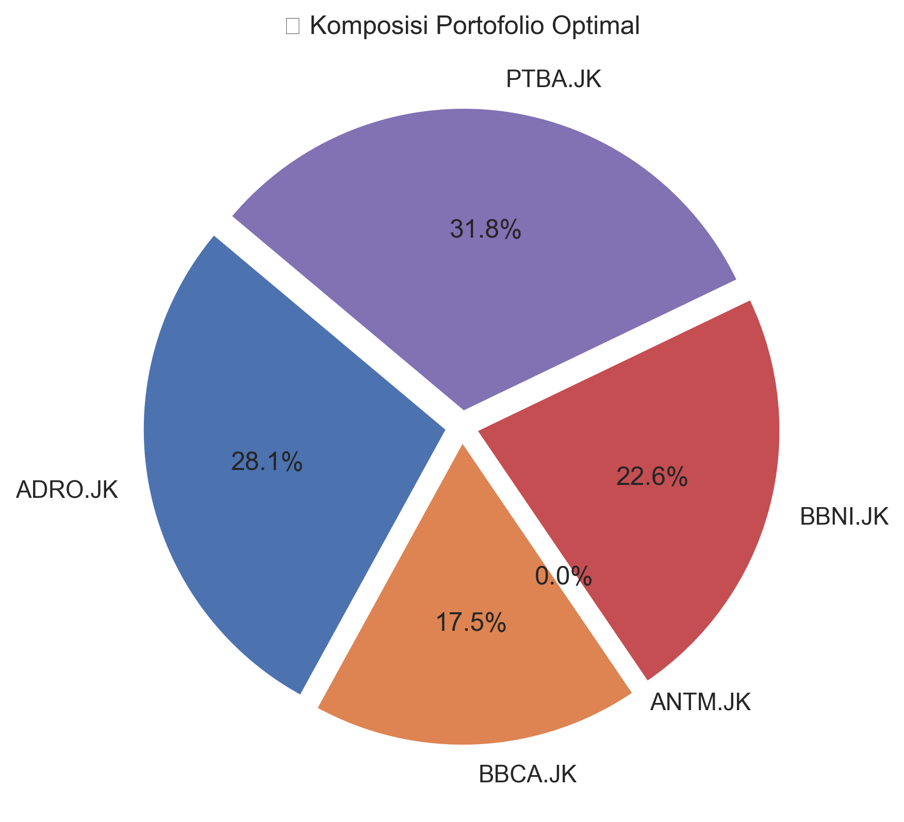

# Portfolio Optimization with Genetic Algorithm (GA)


> Optimizing portfolio allocation across **Stocks**, **Crypto**, and **Mutual Funds (Reksadana)** using a custom **Genetic Algorithm (GA)** approach.

---

## 📖 Deskripsi Singkat

Proyek ini bertujuan mencari **komposisi portofolio optimal** dengan menyeimbangkan antara *return* dan *risk*.
Dengan pendekatan **Algoritma Genetika (Genetic Algorithm)**, sistem akan:

* Membentuk populasi acak portofolio,
* Mengevaluasi berdasarkan fungsi *fitness*,
* Melakukan **seleksi, crossover, dan mutasi**, hingga menemukan kombinasi bobot terbaik.

$$
\text{Fitness} = \text{Return} - \lambda \times \text{Risk}
$$

---

## 🧩 Fitur Utama

* ✅ Mengunduh data historis otomatis (via `yfinance`)
* ✅ Menghitung return dan kovarians tahunan
* ✅ Menjalankan optimasi berbasis Genetic Algorithm
* ✅ Visualisasi hasil (fitness history, efficient frontier, pie chart)
* ✅ Dapat digunakan untuk **Saham, Crypto, dan Reksadana**

---

## ⚙️ Instalasi

### 1️⃣ Clone Repository

```bash
git clone https://github.com/yuriya-dev/portfolio_optimization_genetic_algorithm.git
cd portfolio_optimization_genetic_algorithm
```

### 2️⃣ Install Dependencies

```bash
pip install -r requirements.txt
```

### 3️⃣ Jalankan Notebook

Buka file:

```
portfolio_optimization_ga.ipynb
```

di **Jupyter Notebook** atau **VS Code** (Jupyter extension).

---

## 💼 Ketentuan Setiap Jenis Aset

###  Saham

* **Ticker format:** `'BBCA.JK'`, `'ADRO.JK'`, dst
* **Tahun bursa:** 252 hari
* **Risk Aversion:** 0.5 – 1.0
* **Contoh:**

  ```python
  TICKERS = ['BBCA.JK', 'ADRO.JK', 'PTBA.JK']
  RISK_AVERSION = 0.5
  ```

---

###  Crypto

* **Ticker format:** `'BTC-USD'`, `'ETH-USD'`, `'BNB-USD'`, `'SOL-USD'`
* **Pasar 24/7:** gunakan 365 hari
* **Risk Aversion:** 1.0 – 1.5
* **Saran:** tambahkan batas maksimum per aset (misal max 50%)
* **Contoh:**

  ```python
  TICKERS = ['BTC-USD', 'ETH-USD', 'BNB-USD', 'SOL-USD']
  RISK_AVERSION = 1.2
  ```

---

###  Reksadana

* **Data:** gunakan file CSV NAV (Nilai Aktiva Bersih) harian/bulanan
* **Risk Aversion:** 0.7 – 1.2
* **Contoh:**

  ```python
  data = pd.read_csv('nav_reksadana.csv', index_col='Date', parse_dates=True)
  returns_daily = data.pct_change().dropna()
  ```

---

## 🧪 Cara Menjalankan Program

1. **Atur parameter utama**

   ```python
   TICKERS = ['BTC-USD', 'ETH-USD', 'BNB-USD']
   START_DATE = '2022-01-01'
   RISK_AVERSION = 1.0
   POP_SIZE = 100
   GENERATIONS = 300
   ```

2. **Jalankan semua cell di notebook**

3. **Lihat hasil akhir**

   * Bobot terbaik disimpan di:

     ```
     outputs/best_portfolio_weights.csv
     ```
* Visualisasi hasil di:

  * `outputs/fitness_plot.png`
  * `outputs/portfolio_pie.png`
  * `outputs/efficient_frontier.png`
  * `outputs/best_portfolio_weights.csv`

---

## 📊 Contoh Output

| Visualisasi | Deskripsi |
| :--- | :--- |
|  | Evolusi fitness tiap generasi |
|  | Perbandingan GA optimal vs portofolio acak |
|  | Distribusi bobot tiap aset |
| [best_portfolio_weights.csv](outputs/best_portfolio_weights.csv) | Bobot optimal tiap saham (file CSV) |


---

## 🧠 Saran Pengembangan

✨ **Versi selanjutnya dapat menambahkan:**

* Constraint tambahan (min/max bobot per aset)
* Integrasi biaya transaksi & pajak
* Rolling window (optimasi dinamis)
* Auto-update data real-time via API Binance / Yahoo
* Dashboard interaktif dengan Streamlit
* Multi-objective GA (NSGA-II) untuk memisahkan risiko & return

---

## 🧹 Dependencies

```
numpy
pandas
matplotlib
yfinance
tqdm
```

---

## 👨‍💻 Author

**yuriya-dev**
🌐 [GitHub](https://github.com/yuriya-dev) | 💼 [LinkedIn](https://linkedin.com/in/wahyu-tri-cahya)

---

## 📜 Lisensi

Proyek ini dilisensikan di bawah **MIT License**.
Silakan gunakan dan modifikasi dengan tetap mencantumkan atribusi.

---

> “Optimization is not about perfection, but finding balance between risk and reward.”
> — *Portfolio GA Project*
